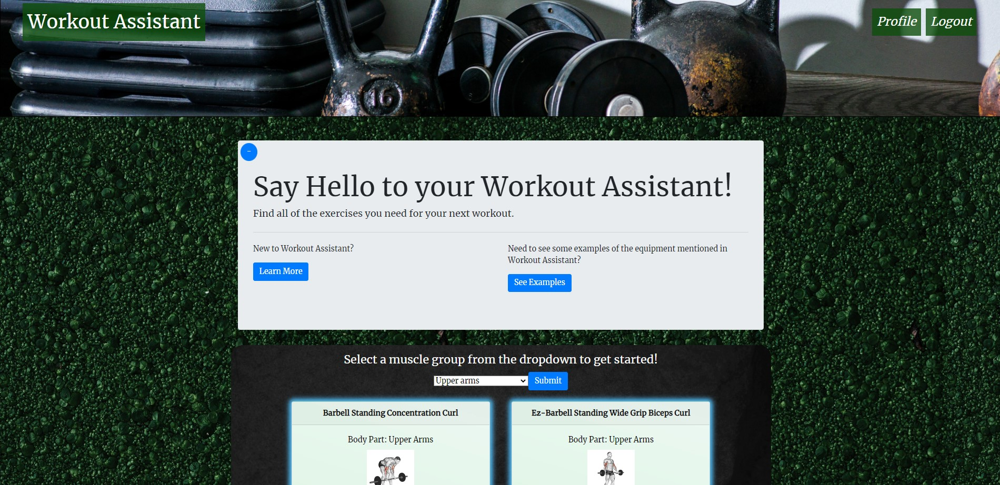

# Workout-Assistant

## Links
* Repository Link: [Workout-Assistant](https://github.com/ryanweiler92/Workout-Assistant)
* Application Link: [Workout-Assistant](https://powerful-beach-20504.herokuapp.com/)
* For any additional questions please reach out to ryanweiler92@gmail.com, kespitalnic@gmail.com or gregoryjohncarter@gmail.com

## Description
Our application provides users with a platform where they can keep track of exercise routines and improve their exercise regiment. 
We provide a user interface which is integrated with our database, so that we can display exercise data and routines unqiue to the user.

## Table of Contents
* [Installation](#installation)
* [Usage](#usage)
* [Contributors](#contributors)
* [Tests](#tests)
* [License](#license)

## Installation
No installation is required. 

## Usage

## Contributors
Ryan Weiler
* GitHub: [Ryan-Weiler-GitHub](https://github.com/ryanweiler92)
Katie Spitalnic
* GitHub: [Katie-Spitalnic-GitHub](https://github.com/kspitalnic)
Gregory Carter
* GitHub: [Gregory-Carter-GitHub](https://github.com/gregoryjohncarter)

## Tests 
No testing available at this time.

## License
